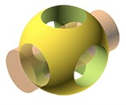

# openscad learning and practicing

learn 3d print modeling using OpenSCAD and tutorial of practicing variable shapes

## Structure of the Learning

- Install and Configure OpenSCAD: [website](https://openscad.org/)
- [OpenSCAD Tutorial](https://en.wikibooks.org/wiki/OpenSCAD_Tutorial)
    - [folder for modeling files](/tutorial/)
- [OpenSCAD User Manual](https://en.wikibooks.org/wiki/OpenSCAD_User_Manual#The_OpenSCAD_User_Manual)
- [OpenSCAD Code Cheat Sheet](https://openscad.org/documentation.html#cheat-sheet)
- [Mastering OpenSCAD within 10 project - book by Jochen Kerdels](https://mastering-openscad.eu/)
    - [folder for project files](/masterOpenSCAD/)
- [OpenSCAD Exercises - book by Sachidanand Jha (order in Amazon)](https://www.amazon.com/dp/B07SNG1C2C?tag=paulrandall-20)

## Learning Videos in my Youtube Channel

https://www.youtube.com/playlist?list=PL6DEHvciXKeUwcYw7k4wKWhW1cbE_omAg

---

Authored by Xiaoqi Zhao, contact my [email](mailto:xiaoqizhao@outlook.com) for any questions.
Copyright, 2023